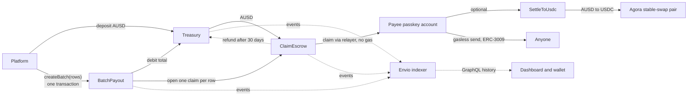

# Fanout

Pay up to 150 people in one transaction. Each person claims their dollars with a link and a passkey.

**Live:** [demo.fanout.tech](https://demo.fanout.tech) (platforms) and [wallet.fanout.tech](https://wallet.fanout.tech) (payees). Runs on Monad testnet with Agora AUSD.

## Why

Paying many people across borders is slow and expensive. Bank wires take days, and every hop takes a fee. Small payouts lose the most.

With Fanout, a platform uploads a CSV and one transaction pays everyone in AUSD, a US dollar stablecoin. Each payee gets a claim link by email and signs in with a passkey. They never buy gas, write down a seed phrase or install a crypto wallet.

The landing page compares a $500 payout: about $448.50 arrives after a week by wire, and $499.90 arrives with Fanout. These are illustrative numbers, defined in [`fees.ts`](apps/web/components/landing/race/fees.ts).

## Try it

It takes about 3 minutes. You need two email inboxes you can open (or one with plus addresses, like `you+1@gmail.com`).

1. **Pay people as a platform.** Open [demo.fanout.tech](https://demo.fanout.tech) and sign in with your email. On the dashboard, press **Get test dollars** to top up your account with testnet AUSD. Open **New payout**, upload a CSV with `email` and `amount` columns (up to 150 rows), review it, and send. One transaction pays everyone.
2. **Claim as a payee.** Open the claim email in the other inbox. Sign in with that email and create a passkey. The dollars land in your passkey account. Gas is paid for you. You can see the amount in your local currency, take USDC instead, send it on, or install the wallet as an app.
3. **Watch it from the platform side.** Back on the payout page, the claim counter shows "1 of N claimed" and each person's status. From there you can send reminders, share links on WhatsApp, and export a CSV.

**Passkeys:** save the passkey to iCloud Keychain (Safari, or Chrome on a Mac with iCloud Keychain) or to Google Password Manager. Desktop Chrome's local profile store can lose the passkey, and with it the way into that account.

## Features

**For platforms**

- **CSV payouts, one transaction.** Up to 150 rows, checked before sending. [`csv.ts`](apps/web/lib/csv.ts), [`new-payout-flow.tsx`](apps/web/components/payouts/new-payout-flow.tsx), [`BatchPayout.sol`](smart-contract/contracts/BatchPayout.sol)
- **Claim emails and WhatsApp sharing.** Each payee gets their own link. [`claim-email.ts`](apps/web/lib/email/claim-email.ts), [`claim-link-actions.tsx`](apps/web/components/payouts/claim-link-actions.tsx)
- **Live claim counter and per-person status.** [`claim-counter.tsx`](apps/web/components/payouts/claim-counter.tsx), [`batch-detail.tsx`](apps/web/components/payouts/batch-detail.tsx)
- **Reminders and CSV export.** [`claim-reminders.tsx`](apps/web/components/payouts/claim-reminders.tsx), [`batch-export.ts`](apps/web/lib/batch-export.ts)
- **Refunds.** Money not claimed within 30 days goes back to the platform's balance. [`ClaimEscrow.sol`](smart-contract/contracts/ClaimEscrow.sol)
- **Add money from another chain** with Aurora (mainnet routes only). [`aurora.ts`](apps/web/lib/aurora.ts), [`cross-chain-dialog.tsx`](apps/web/components/dashboard/cross-chain-dialog.tsx)

**For payees**

- **Claim with a passkey, no gas.** The passkey is the account. A relayer submits the claim and pays the gas. [`claim-flow.tsx`](apps/web/components/claim/claim-flow.tsx), [`passkey-account.ts`](apps/web/lib/payee/passkey-account.ts), [`relayer.ts`](apps/web/lib/fanout/relayer.ts)
- **Local currency.** Amounts shown in 30 currencies at today's rate. [`fx.ts`](apps/web/lib/fx.ts)
- **Take USDC instead.** Swapped 1:1 through Agora's AUSD/USDC stable-swap pair. [`SettleToUsdc.sol`](smart-contract/contracts/SettleToUsdc.sol), [`usdc-offer.tsx`](apps/web/components/payee/usdc-offer.tsx)
- **Send with no fee.** To an address or a scanned QR code, the payee signs an ERC-3009 authorization and the relayer submits it. Payees can also pay anyone by email. [`erc3009.ts`](apps/web/lib/fanout/erc3009.ts), [`send-flow.tsx`](apps/web/components/wallet/send-flow.tsx), [`email-send-flow.tsx`](apps/web/components/wallet/email-send-flow.tsx)
- **Installable app (PWA)**, locked behind the passkey. [`manifest.ts`](apps/web/app/manifest.ts), [`install-prompt.tsx`](apps/web/components/payee/install-prompt.tsx), [`app-lock.ts`](apps/web/lib/payee/app-lock.ts)
- **Earnings Passport.** Prove "at least $X a month from N platforms" without listing each payment. A second key from the same passkey signs the statement, and anyone can check it on the public `/verify` page. [`passport.ts`](apps/web/lib/payee/passport.ts), [`passport-key.ts`](apps/web/lib/payee/passport-key.ts), [`verify-view.tsx`](apps/web/components/passport/verify-view.tsx)

## How it works



1. The platform deposits AUSD into the **Treasury**, which keeps a balance per platform.
2. `BatchPayout.createBatch` takes the whole CSV. In one transaction it debits the platform's balance, moves the total to **ClaimEscrow**, and opens one claim per row.
3. Each claim link carries a one-time key in the URL fragment, which never reaches a server. The payee signs in with the email the payment was sent to, and a verifier co-signs the claim. The relayer submits it and the AUSD goes to the payee's passkey account.
4. Unclaimed money can be refunded to the platform's Treasury balance after 30 days.
5. The [Envio indexer](indexer/) reads the contract events and serves payout and wallet history over GraphQL.

Contract details: [smart-contract/README.md](smart-contract/README.md).

## Onchain proof

Monad testnet, chain id `10143`. These are the contracts the live site uses (the `monad-v3` deployment).

| Contract | Address |
| --- | --- |
| Treasury | [`0xecC2616C45a55AEA2d33374E4B99D64d0900255c`](https://testnet.monadscan.com/address/0xecC2616C45a55AEA2d33374E4B99D64d0900255c) |
| BatchPayout | [`0x01aD7B7A7Ab17ffE4fDFE4644828167702338386`](https://testnet.monadscan.com/address/0x01aD7B7A7Ab17ffE4fDFE4644828167702338386) |
| ClaimEscrow | [`0x15DaAD3E6200051AE2F956ba32cD8033e82d40B6`](https://testnet.monadscan.com/address/0x15DaAD3E6200051AE2F956ba32cD8033e82d40B6) |
| SettleToUsdc | [`0xA1ac3cBe75697e4Ad7C5fF393EbC3AE9fa67DeC2`](https://testnet.monadscan.com/address/0xA1ac3cBe75697e4Ad7C5fF393EbC3AE9fa67DeC2) |
| AUSD (Agora) | [`0xa9012a055bd4e0eDfF8Ce09f960291C09D5322dC`](https://testnet.monadscan.com/address/0xa9012a055bd4e0eDfF8Ce09f960291C09D5322dC) |
| Agora AUSD/USDC pair | [`0x1Aa8958Aa34cEC8096EF4381cb335effe977b0ae`](https://testnet.monadscan.com/address/0x1Aa8958Aa34cEC8096EF4381cb335effe977b0ae) |

Example transactions:

| What | Transaction |
| --- | --- |
| Deploy Treasury | [`0x0664…40b1`](https://testnet.monadscan.com/tx/0x066467fd4fde22d0b9e690a10c141e82154abac0884a70d18ae832ce907640b1) |
| Deploy ClaimEscrow | [`0x1892…5c20`](https://testnet.monadscan.com/tx/0x18926816e4efe415db20738af81d3f2af618264a5e62ab4a3235094fef7e5c20) |
| Deploy BatchPayout | [`0x9ee3…357b`](https://testnet.monadscan.com/tx/0x9ee385eb0525dda043a2a00f3d621698ac85249df785667f7b8c45e769d0357b) |
| Deploy SettleToUsdc | [`0xd77a…a86e`](https://testnet.monadscan.com/tx/0xd77a76a3f88950abbb81a181fd988a315d5772529f367128e022f4afd0eaa86e) |
| Platform deposits 1,000 AUSD (previous `monad-ausd` contracts) | [`0xb6a4…890e`](https://testnet.monadscan.com/tx/0xb6a49bc37edf81adf2ed58ebbfa149cd21e858f9a363aa7d6b454261da8e890e) |
| `createBatch`: 5 people, $137, one transaction (`monad-ausd`) | [`0x74cb…9e16`](https://testnet.monadscan.com/tx/0x74cb82ae80663371f9fe443c717fc990aee35dc38972e31835de2a4a173a9e16) |
| A payee's claim from that batch, sent by the relayer (`monad-ausd`) | [`0xd11d…be82`](https://testnet.monadscan.com/tx/0xd11d5eb6acd79badc31f1fcb7382123b80b9964fd94bff92214fb167ec20be82) |

Deploy records, including every transaction: [`smart-contract/ignition/deployments/`](smart-contract/ignition/deployments/).

## Built with

- **[Monad](https://monad.xyz)**: the chain. A 150-row payout fits in one transaction. [`chains.ts`](apps/web/lib/chains.ts), [`hardhat.config.ts`](smart-contract/hardhat.config.ts)
- **[Agora](https://agora.finance) AUSD and stable-swap**: AUSD is the payout dollar. Its AUSD/USDC pair changes dollars to USDC for payees who want it, and its ERC-3009 support makes gasless sends possible. [`SettleToUsdc.sol`](smart-contract/contracts/SettleToUsdc.sol), [`usdc-settle.ts`](apps/web/lib/fanout/usdc-settle.ts), [`erc3009.ts`](apps/web/lib/fanout/erc3009.ts)
- **[Mera](https://mera.category.xyz)**: turns a passkey into an EVM account, and a second key from the same passkey signs the Earnings Passport. [`passkey-account.ts`](apps/web/lib/payee/passkey-account.ts), [`passport-key.ts`](apps/web/lib/payee/passport-key.ts)
- **[Privy](https://privy.io)**: email sign-in for platforms and payees. It proves a claimer owns the email a payment was sent to. [`lib/auth/`](apps/web/lib/auth/)
- **[Chainlink CRE](https://docs.chain.link/cre)**: runs the recurring work. One workflow returns unclaimed money to platforms once a payout's claim window ends; another submits the payouts a platform scheduled ahead of time. Both deliver signed reports to a small receiver contract. [`cre/`](cre/), [`refund-expired/workflow.ts`](cre/refund-expired/workflow.ts), [`scheduled-payouts/workflow.ts`](cre/scheduled-payouts/workflow.ts), [`FanoutKeeper.sol`](smart-contract/contracts/FanoutKeeper.sol)
- **[Envio](https://envio.dev)**: indexes the contracts for payout history, claim status and wallet activity. [`indexer/`](indexer/), [`indexer.ts`](apps/web/lib/fanout/indexer.ts)
- **[Aurora](https://aurora.dev) Intents**: lets a platform add money from Base, Arbitrum, Ethereum and other chains. [`aurora.ts`](apps/web/lib/aurora.ts), [`aurora-server.ts`](apps/web/lib/aurora-server.ts)
- **[Kimi](https://platform.kimi.ai) (Moonshot AI)**: the AI assistance, through its OpenAI-compatible API. It reads messy payout spreadsheets, rewords unusual-payout warnings and drafts Earnings Passport letters; it only proposes, and every payout row still goes through the CSV checks and a person's approval. [`lib/ai/`](apps/web/lib/ai/), [`lib/assist/`](apps/web/lib/assist/), [`app/api/ai/`](apps/web/app/api/ai/)
- **[PostHog](https://posthog.com)**: product analytics and error tracking. Claim keys are scrubbed from every event. [`instrumentation-client.ts`](apps/web/instrumentation-client.ts), [`scrub.ts`](apps/web/lib/analytics/scrub.ts)

## Run it locally

Prerequisites: Node 22 or later, pnpm 9 (`corepack enable`). [Foundry](https://getfoundry.sh) is optional, for `cast`. Docker is needed only to run the indexer locally.

```bash
pnpm install
cp apps/web/.env.example apps/web/.env.local
pnpm dev                     # http://localhost:3000
```

**Mock mode (default, no keys needed).** With `NEXT_PUBLIC_USE_MOCK=true` the app uses an in-memory client and a local sign-in. No chain calls. On a payout page, **Simulate people claiming** fills the claim counter.

**Onchain mode.** Set `NEXT_PUBLIC_USE_MOCK=false` and fill in [`apps/web/.env.example`](apps/web/.env.example):

- `NEXT_PUBLIC_PRIVY_APP_ID`, `PRIVY_APP_SECRET`: email sign-in
- `RELAYER_PRIVATE_KEY`: a testnet-only key funded with MON ([faucet](https://faucet.monad.xyz)); pays gas for claims, sends and USDC swaps
- `VERIFIER_PRIVATE_KEY`: co-signs claims; its address must be `ClaimEscrow.verifier`
- `RESEND_API_KEY`, `CLAIM_EMAIL_FROM`: claim emails
- Optional: `NEXT_PUBLIC_POSTHOG_PROJECT_TOKEN`, `NEXT_PUBLIC_POSTHOG_HOST`, `AURORA_APP_KEY`, `NEXT_PUBLIC_INDEXER_URL`

Contract addresses default to the deployment in [`contracts.generated.ts`](apps/web/lib/fanout/abis/contracts.generated.ts).

To make a test CSV (only use inboxes you control; every row gets an email):

```bash
pnpm --filter web demo-csv --to you@yourdomain.com   # 150 plus addresses of your own inbox
```

**Checks**

```bash
pnpm --filter web test       # unit tests (Vitest)
pnpm lint
pnpm typecheck
```

**Contracts** (`smart-contract/`, Hardhat 3):

```bash
pnpm --filter smart-contract build
pnpm --filter smart-contract test
pnpm --filter smart-contract typecheck
pnpm --filter smart-contract export-abis   # copy ABIs and addresses into the web app
```

Deploying needs `MONAD_PRIVATE_KEY` in `smart-contract/.env` (see `smart-contract/.env.example`). The deploy scripts are in [`smart-contract/package.json`](smart-contract/package.json).

**Indexer** (`indexer/`, its own pnpm project, not part of the root workspace):

```bash
cd indexer
pnpm install
cp .env.example .env         # ENVIO_API_TOKEN
pnpm codegen
pnpm test                    # handler tests, no network needed
pnpm dev                     # local indexer, needs Docker
```

**Recurring work** (`cre/`, Chainlink CRE workflows in TypeScript, run with [Bun](https://bun.sh)):

- `refund-expired`: on a cron, asks the indexer for payments still unclaimed after their claim window and sends one report that refunds them (`ClaimEscrow.refundMany`) to the platforms that paid them.
- `scheduled-payouts`: on a cron, reads a schedule of payouts the platform signed ahead of time (one CreateBatch authorization per period, made with `cre/scripts/sign-schedule.ts`), checks each due one onchain, and sends it (`BatchPayout.createBatchFor`).

Both send their reports to [`FanoutKeeper`](smart-contract/contracts/FanoutKeeper.sol), which accepts them only from the Chainlink forwarder and, once configured, only from the expected workflow owner and workflow ids. Neither workflow can move money anywhere but where the platform already agreed: refunds always go back to the paying platform, and every scheduled row is covered by the platform's signature.

```bash
pnpm cre:setup               # install the workflows' dependencies
pnpm cre:test                # workflow tests with the CRE SDK's test runtime
pnpm cre:simulate            # end to end on a local fork of Monad testnet (needs anvil)
```

`cre:simulate` forks Monad testnet, deploys FanoutKeeper on the fork, creates an expired and an open payout and two scheduled ones, then runs `cre workflow simulate --target local-simulation --broadcast` for both workflows and checks the result onchain: expired rows refunded, the open row untouched, the due scheduled payout created. `cre workflow simulate` needs a CRE account (`cre login`); without one the script delivers the same reports through the fork's MockKeystoneForwarder instead and runs the same checks.

To deploy: deploy FanoutKeeper with `ignition/modules/FanoutKeeper.ts` and the forwarder for the chain ([forwarder directory](https://docs.chain.link/cre/guides/workflow/using-evm-client/forwarder-directory-ts)), put its address in `config.production.json` for both workflows, then `cre workflow deploy <workflow> --target production-settings` (deploying needs CRE deploy access). Finally call `setExpectedWorkflowOwner` and `setWorkflowIdAllowed` on the keeper.

## Repo layout

```
apps/web/          Next.js app: landing page, platform dashboard, claim page, payee wallet, /verify
  app/api/         relayer (claim, send, settle), claim emails, FX rates, Aurora
  lib/fanout/      contract client (onchain and mock), relayer, claim keys, indexer queries
  lib/payee/       passkey account, app lock, Earnings Passport
smart-contract/    Treasury, BatchPayout, ClaimEscrow, SettleToUsdc, FanoutKeeper; tests; Ignition deploy records
indexer/           Envio indexer for the contract events
cre/               Chainlink CRE workflows: expired-payment refunds, scheduled payouts; local fork simulation
Fanout — PRD.md    product requirements
```

## License

[MIT](LICENSE)
